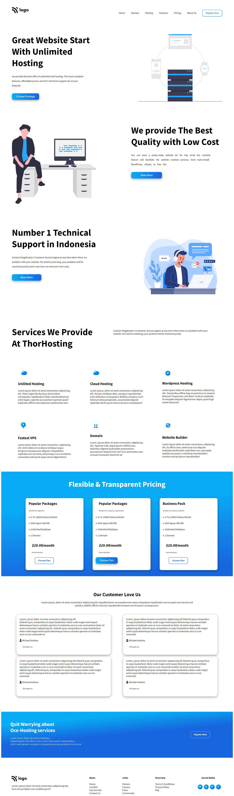

# HTML Project 11
**I Am Abhishek Singh**
> This is my eleventh project of HTML and CSS and it have one page content with length of page is bigger than most of the previous pages and Obvousily it is bit challenging.

 #

## Project Web page

In this project I lerned about grid which helped me with service section by use of grid things become bit easy it have most helful functionality as row-gap and column-gap.

#

### Duration Of Completing this project
> Honestly it took me more than **7 hours** .

[Visit This Project Live](https://abhi-project-1.netlify.app/)

#

To see my work visit my [Portfolio]("my-portfolio-website")

